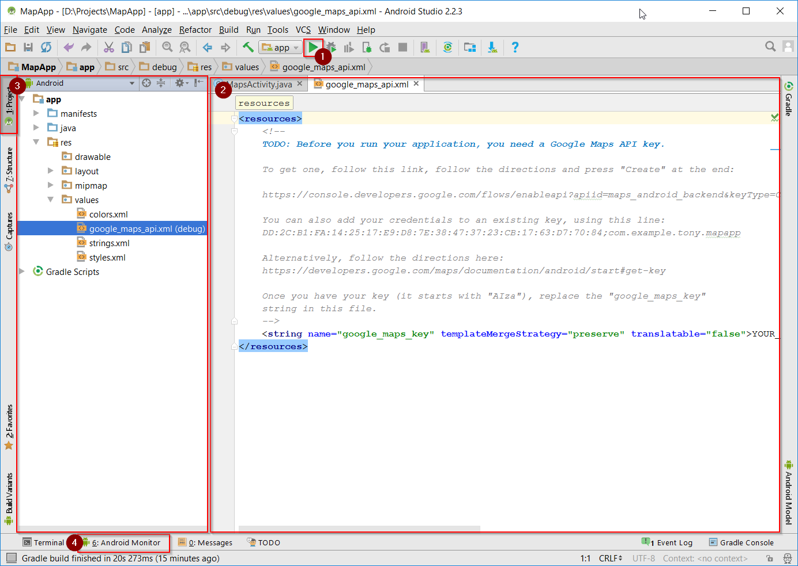

# Exercise 1 

Concepts
- New app
- Java / Manifest files
- Permissions (new for Android 6.0 "M")
- Android Studio / Gradle errors

## Install and Introduction with Google Maps app

### Install

Download [Android Studio](https://developer.android.com/studio/index.html)

* Install with defaults, Android Studio now installs the SDK for you to the user app data folder
* Run Android Studio that will update dependencies further.


### Start a new Android Studio project

* Configure new project - Might want to move the location from the default!
* Form factors - Phone and Tablet - Minimum API 15 is a good
* Add Activity - Google Maps activity

The Main UI of Android studio opens.

Key items:



1. Run button
2. Project view
3. Code Window
4. Android Monitor - View Logcat of connected device.

See [Android Studio User Guide](https://developer.android.com/studio/intro/index.html) for more

## Running App

### Get Google API key

The new project's `google_maps_api.xml` file contains a link for getting an API key directly when you already have a developer account, **Note: this key is specific for each app namespace/SHA fingerprint**

For more instructions see [Google Map API documentation](https://developers.google.com/maps/documentation/android-api/start#get-key)

1. Get API key
2. Update the YOUR_KEY_HERE variable in `google_maps_api.xml` with the API key from Google, this key will start with 'AIza'

### Run

Press the 'Run' button 

##### Instant Run

Instant run sounds like a great idea but in personal experience it causes confusion when it fails to update correctly or resource files change.

Advise this is turned off:

`File > Settings > Build, Execution, Deployment > Instant Run`

Uncheck enable.

##### If it doesn't compile with _DexIndexOverflowException_

Does it work? Likely not if _DexIndexOverflowException_ occurs this is because adding Maps as added the huge Google Maps library and Android has an limit of 65536 Methods in the DEX files.

To fix this: 

Open, Under Project > Gradle Scripts > build.gradle (module: app) 

add `multiDexEnabled true`  to the `defaultConfig` block inside the `android` block

for example:
```
android {
    compileSdkVersion 25
    buildToolsVersion "25.0.2"
    defaultConfig {
        applicationId "com.example.mapapp"
        minSdkVersion 15
        targetSdkVersion 25
        versionCode 1
        versionName "1.0"
        testInstrumentationRunner "android.support.test.runner.AndroidJUnitRunner"
        multiDexEnabled true
    }
    buildTypes {
        release {
            minifyEnabled false
            proguardFiles getDefaultProguardFile('proguard-android.txt'), 'proguard-rules.pro'
        }
    }
}
```

### Run again

This should now build and install

## Understanding the app

##### app/manifests
The `AndroidManifest.xml` describes the app, its permissions, linking its name, icons, themes and activities.

> Activities created in the app must be defined here, otherwise the app will crash when they are created.

##### app/java
The java code, note there are 3 folders, for the actual app code, pure java unit test code and android unit test code.

> The app only has one file `MapsActivity.java`

##### app/res

* drawables: image files, png or other types such as svg.
* layouts: XML describing the screen layout, can be for an activity for a sub view. 
* mipmap: more images, i.e. the apps icon is here, note the icon is actually many files for each different resolution required.
* values: colors, strings, styles defined in XML, for customisation and localisation. The app name can be changed here.

##### Gradle Scripts

`build.gradle (Module: app)` is the only file of interest for a small test project.

### Activity/Layout Link

In `MapsActivity.java` the layout is linked via `setContentView(R.layout.activity_maps);` in `onCreate`

## Extending App

* Add "My location" see https://developers.google.com/maps/documentation/android-api/location

>* Add permissions to manifest (actually its already added but key to understand this)
```
<uses-permission android:name="android.permission.ACCESS_FINE_LOCATION"/>
<uses-permission android:name="android.permission.ACCESS_COURSE_LOCATION"/>
```
* Don't forget to request runtime permission for >= Android M

#### Changes

Add something like this in the Activity's `onMapReady()` method

```
if (ContextCompat.checkSelfPermission(this, Manifest.permission.ACCESS_FINE_LOCATION)
                == PackageManager.PERMISSION_GRANTED) {
    mMap.setMyLocationEnabled(true);
} else {
    // request permission.
    ActivityCompat.requestPermissions(thisActivity,
                new String[]{Manifest.permission.ACCESS_FINE_LOCATION},
                MY_PERMISSIONS_REQUEST_ACCESS_FINE_LOCATION);
}
```
and
```
@Override
public void onRequestPermissionsResult(int requestCode, String[] permissions, int[] grantResults) {
    if (requestCode == MY_PERMISSIONS_REQUEST_ACCESS_FINE_LOCATION) {
      if (permissions.length == 1 &&
          permissions[0] == Manifest.permission.ACCESS_FINE_LOCATION &&
          grantResults[0] == PackageManager.PERMISSION_GRANTED) {
        mMap.setMyLocationEnabled(true);
    } else {
      // Permission was denied. Display an error message.
    }
}
```

Where `MY_PERMISSIONS_REQUEST_ACCESS_FINE_LOCATION` is a const int

Android Studio will highlight in red things it cannot currently resolve, clicking it and pressing alt+enter or clicking the red lightbulb provides help for most things.


`Manifest.permission.ACCESS_FINE_LOCATION` doesn't get fixed automatically because your app will contain a generated Manifest class. removing the prefix so only `ACCESS_FINE_LOCATION` is present will allow Android Studio to resolve it correctly.


