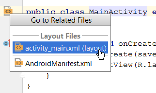
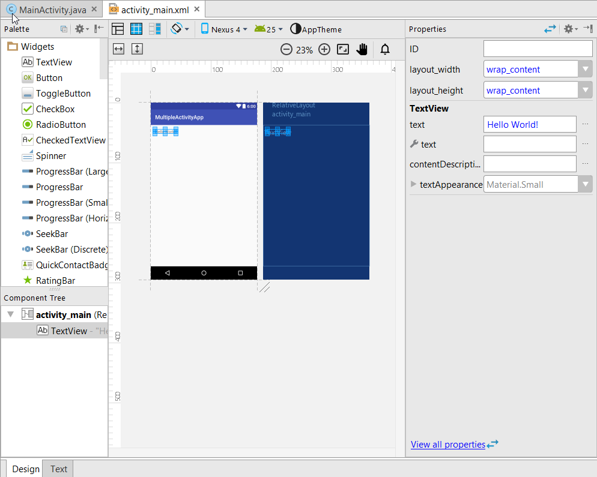
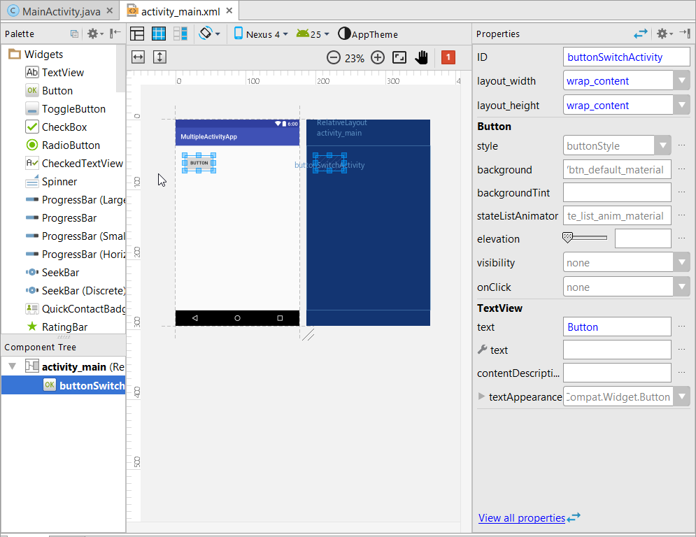
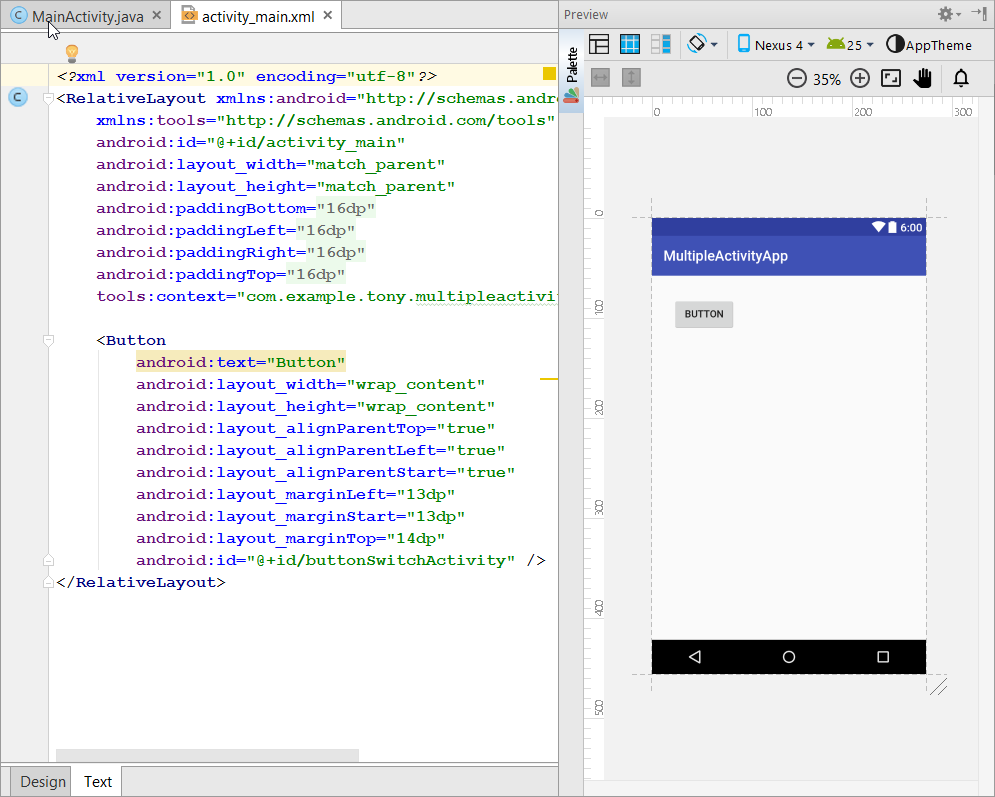
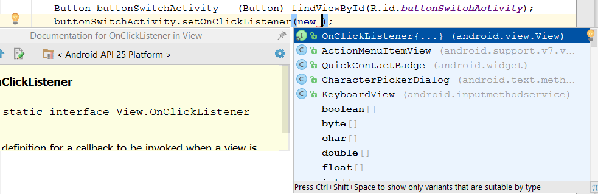
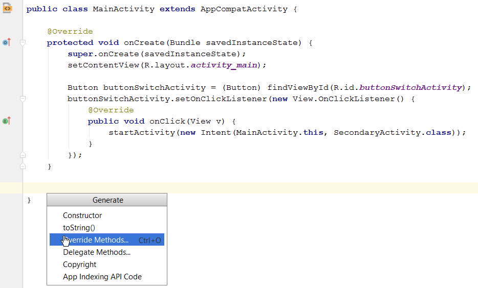

# Exercise 2

Concepts
- New app
- Intents
- Java
- Android Studio / Gradle errors

## Multiple Activity app

### Create New Project and add first Activity

* Configure new project - Might want to move the location from the default!
* Form factors - Phone and Tablet - Minimum API 15 is a good
* Add Activity - **Empty** activity
* Call it `MainActivity` as suggested
* Finish

### Add Second Activity

* File > New > Activity > Empty Activity
* Call it `SecondaryActivity`
* Finish

### Add Button to `MainActivity`

#### Add to Layout

Open `MainActivity.java`

Note the icon in the margin next to the class definition allows you to jump to the layout file.



Go to the Layout which will appear in the layout editor.

Select and Delete the TextView containing "Hello World"



Drag a Button from the Widget Palatte, and set its ID (here its set to `buttonSwitchActivity`)



To see the XML making the Layout click the Text tab on the editor



Note: by default its using a RelativeLayout, this allows widgets to be positioned relative to the screen and each other. Other [layout types are available](https://developer.android.com/guide/topics/ui/declaring-layout.html#CommonLayouts)

#### Add code

Switch back to `MainActivity.java`

In the `OnCreate` method add code to use the button in the layout, this must be after `setContentView` otherwise the layout and button has not been created yet.

> **Do Not Copy-Paste this**
```
Button buttonSwitchActivity = (Button) findViewById(R.id.buttonSwitchActivity);
buttonSwitchActivity.setOnClickListener(new View.OnClickListener() {
    @Override
    public void onClick(View v) {
        startActivity(new Intent(MainActivity.this, SecondaryActivity.class));
    }
});
``` 
> **Do Not Copy-Paste this**

Instead try to use Android Studio's completion and alt-enter symbol resolving.

Try typing:
`Button buttonSwitchActivity = findViewById(R.id.buttonSwitchActivity);`
Then using Alt-Enter to: 
* Resolve Import for Button
* Cast View to Button

Also note Ctrl+Space can autocomplete `R.id.b` to `R.id.buttonSwitchActivity` amoungst other things.

Ctrl+Space followed by Enter can be used to finish the OnClickListener too



Final note, `MainActivity.this` is used to provide the Activity to the intent, `this` would refer to the View.OnClickListener.

### Add Button to `SecondaryActivity`

Almost the same as before except
* the `OnClick` event needs `startActivity(new Intent(SecondaryActivity.this, MainActivity.class));`

Run the app to check you can switch between the Activities.

### Illustrating the Activity Lifecycle

As we have an App with two activities a simple illustration of the Activity Lifecycle can be created

Activity Lifecycle States

* `OnCreate` occurs when creating the activity for the first time
* `OnStart` occurs when starting the activity for the first time - Mostly ignored
* `OnResume` occurs when the activity is first started or returned to, this could be by switching activities in the app, or from the user switching to this app
* `OnPause` occurs when the activity is being left, this could be from switching activities in the app, or from the user switching switching apps 
* `OnStop` occurs when stopping the activity - Mostly ignored
* `OnDestroy` occurs when the activity is removed from memory

To do this we will add Toasts. In Android Toasts appear over the top of the active screen, they are shown for a specified length of time and can be stacked up.

In `MainActivity.java` override `OnPause` to add a toast to show when the Activity is paused

> **Do Not Copy-Paste this**
```
@Override
protected void onPause() {
    super.onPause();
    Toast.makeText(this, "MainActivity Paused", Toast.LENGTH_SHORT).show();
}
``` 
> **Do Not Copy-Paste this**

Instead try to use Android Studio's code generation. Add some blank lines under the `OnCreate` method and press Alt+Insert



Select 'Override Methods' and type OnPause to jump to the method to override then press Enter, add the Toast code as above but be sure not to remove `super.onPause()`.

Add similar code Toast code to the end of OnCreate

You should then have 

```
public class MainActivity extends AppCompatActivity {

    @Override
    protected void onCreate(Bundle savedInstanceState) {
        super.onCreate(savedInstanceState);
        setContentView(R.layout.activity_main);

        Button buttonSwitchActivity = (Button) findViewById(R.id.buttonSwitchActivity);
        buttonSwitchActivity.setOnClickListener(new View.OnClickListener() {
            @Override
            public void onClick(View v) {
                startActivity(new Intent(MainActivity.this, SecondaryActivity.class));
            }
        });

        Toast.makeText(this, "MainActivity Created", Toast.LENGTH_SHORT).show();
    }

    @Override
    protected void onPause() {
        super.onPause();
        Toast.makeText(this, "MainActivity Paused", Toast.LENGTH_SHORT).show();
    }
}
```

* Do the same in `SecondaryActivity.java`.

* Run: notice pressing the button always pauses the current Activity and creates a new Activity each time due to the `startActivity` call, however if you then use the Android back button the existing activity is returned to and no new Activity is created.

Instead of using `startActivity( ... )` to switch back to `MainActivity` try using `finish()` instead. This is the same as pressing back, this will then recall `MainActivity` from the stack and resume it, as opposite to creating a new instance.

