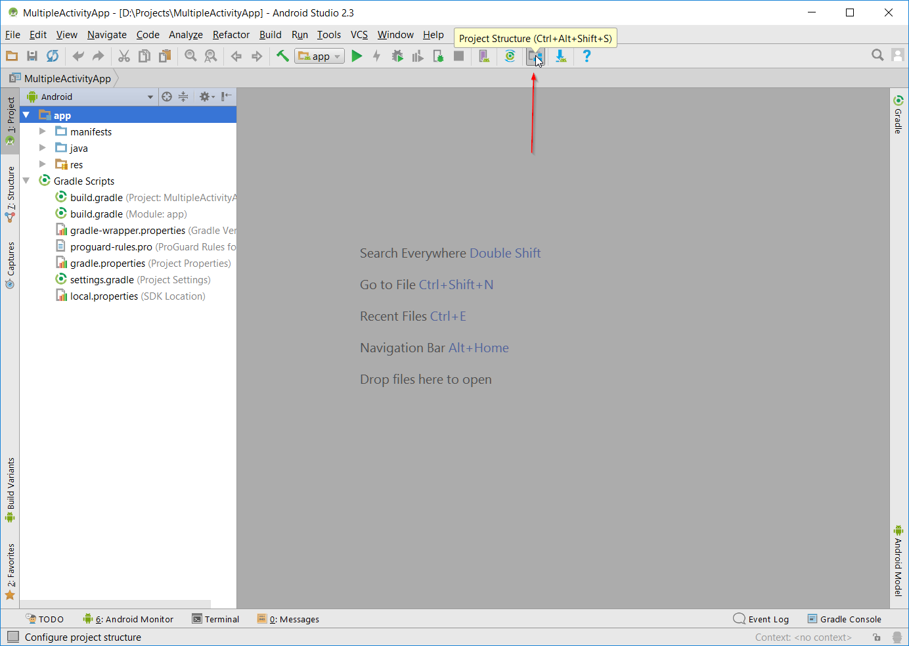
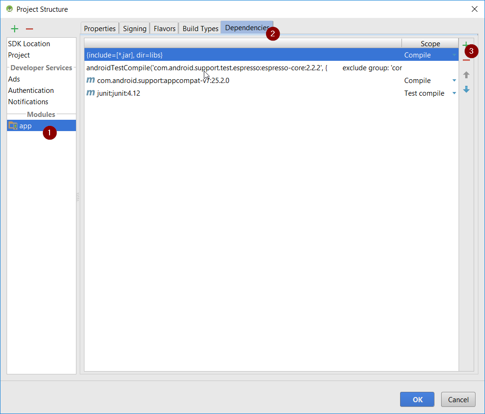
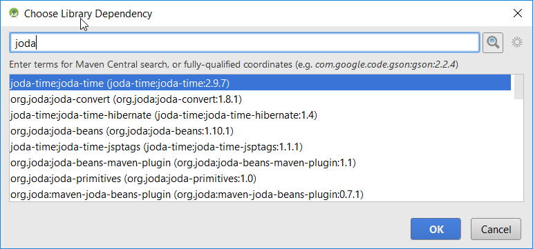
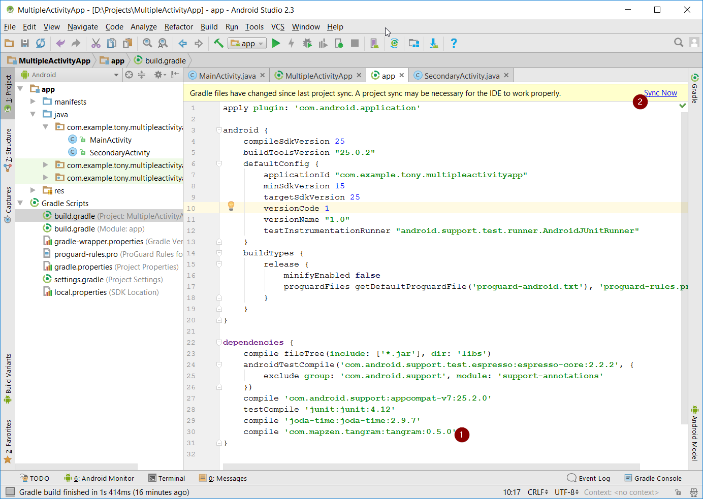

# Exercise 3

Concepts
- Importing Libraries
- Gradle 

## Adding 3rd Party Libraries to Android Studio Project

Taking the app from the exercise 2 this exercise shows how to use 3rd party libraries.

### The GUI way

Press the Project Structure button



1. Select the module 'app'
2. Select the 'Dependencies' tab
3. Press the add button and select 'Library dependency'



Add the 'joda-time' library to the app 

1. Type 'joda' in the box and pressing search.
2. Select the 'joda-time:joda-time' entry and press OK.



Press OK on the Project Structure window. Gradle will resync to include the new library.

You can now use joda-time in your app i.e. `DateTime.now()`

### The Manual way

First to see what Android Studio did to import joda-time

Under Gradle Scripts in the Project view, open `build.gradle (Module: app)`

In the `dependencies` block notice the `compile 'joda-time:joda-time:x.x.x'`

That's all, unless the Library isn't found in the default repository.

#### The Manual way using a library from another repository

Gradle resolves library dependencies by searching repositories listed in `build.gradle (Project: *MyAppName*)` `allprojects` > `repositories` block i.e.

```
allprojects {
    repositories {
        jcenter()
    }
}
```

So unless a library can be resolved by jcenter gradle will fail. 

Libraries such as Tangram-ES are hosted in mavenCentral therefore to use it, the allprojects block must be updated to include the repository

```
allprojects {
    repositories {
        jcenter()
        mavenCentral()
    }
}
```

Then the dependency can be added to `build.gradle (Module: app)`. Be sure to press the sync button to force gradle to download the library



#### Custom Maven Repository

`jcenter()` and `mavenCentral()` are well known repositories and defined for gradle to resolve.

Other libraries are hosted to less well known repositories and must be defined.

For example this library uses its own maven repository https://github.com/ElectronicChartCentre/java-vector-tile

The github page shows how to use the library in terms of Maven:

```
<repository>
    <id>ECC</id>
    <url>https://github.com/ElectronicChartCentre/ecc-mvn-repo/raw/master/releases</url>
</repository>

<dependency>
    <groupId>no.ecc.vectortile</groupId>
    <artifactId>java-vector-tile</artifactId>
    <version>1.2.1</version>
</dependency>
```

To use this in gradle, first add the repository to `build.gradle (Project: *MyAppName*)` in the `allprojects` > `repositories` block  i.e.

```
allprojects {
    repositories {
        jcenter()
        mavenCentral()
        maven {
            url "https://github.com/ElectronicChartCentre/ecc-mvn-repo/raw/master/releases"
        }
    }
}
```

Then add the dependency to `build.gradle (Module: app)` `dependencies` block

To convert from the maven descriptor above: 
compile '_groupId_:__artifactId__:_version_' 

i.e. `compile 'no.ecc.vectortile:java-vector-tile:1.2.1'`

Try it out with other libraries...

There are plenty to be found here: https://android-arsenal.com/
